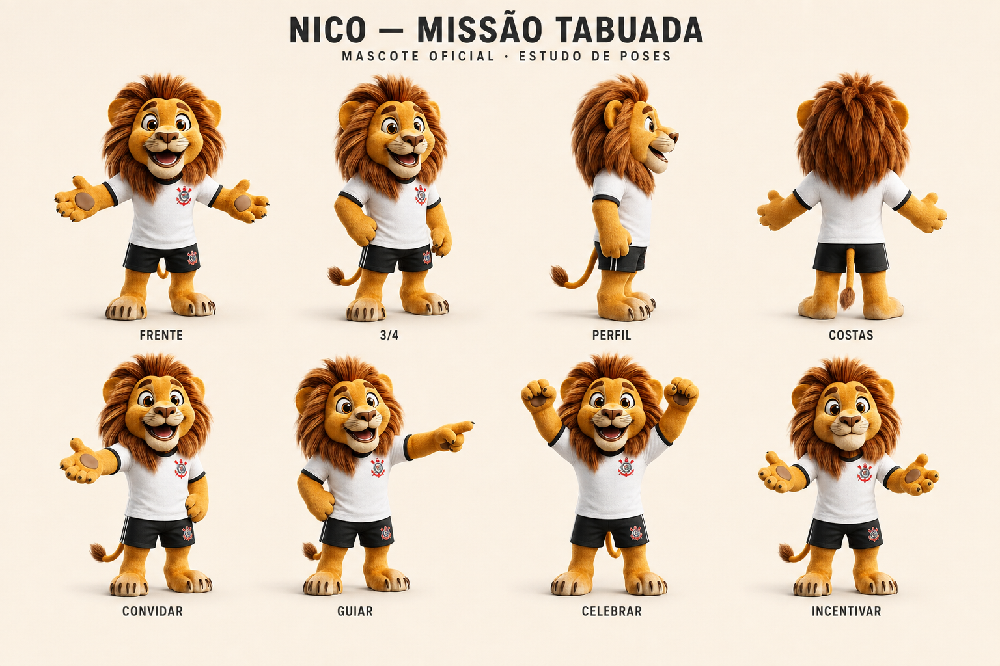

# Nico — mascote oficial

## Cânone visual

Leão masculino dourado, juba castanha volumosa, focinho creme, olhos castanhos grandes e expressão amigável. Camiseta branca do Corinthians com gola e punhos pretos, shorts pretos do Corinthians, patas descalças e cauda natural. Sem lenço, capa ou capacete. Preservar a referência aprovada pelo usuário: não substituir por onça, tigre, humano, robô ou desenho SVG simplificado.

O nome Nico permanece. A escolha do leão substitui as direções conceituais anteriores. “Oficial” se refere ao papel no jogo, não a uma parceria com o clube.

## Uso por estado

| Estado | Asset | Função |
| --- | --- | --- |
| idle | /mascots/nico-leao/welcome.webp | Boas-vindas e convite |
| guide | /mascots/nico-leao/guide.webp | Destino e orientação |
| win | /mascots/nico-leao/celebrate.webp | Acerto, vitória e meta diária |
| try | /mascots/nico-leao/encourage.webp | Erro e nova tentativa |

Os quatro WebPs têm transparência real e canvas 512 × 640. Os PNGs de origem estão preservados na mesma pasta. A prancha é uma referência visual, não um arquivo vetorial de escudo nem um modelo 3D.

## Integração narrativa

`MascotScene` compõe o leão no campo de futebol, com gramado, arquibancada, sombra de contato e bola. Não usar a prancha inteira dentro da partida nem exibir Nico em uma galeria isolada. O futebol substitui o universo espacial por decisão do usuário.

Na Home, Nico convida para entrar em campo junto do progresso real do dia. A preparação usa a etapa selecionada no campeonato. Durante o jogo, `FootballPitch` reúne o mascote, a bola e o gol. Dois passes e um chute (três acertos) marcam um gol; quinze acertos completam os cinco gols da partida. Nico comemora os acertos e incentiva nas novas tentativas.

Usar frases encorajadoras e curtas. O erro não gera vergonha, cobrança ou ameaça de perder prêmio. A meta diária concluída permite encerrar o treino: “Pode encerrar. Nosso próximo treino é amanhã.”

## Acessibilidade e manutenção

Texto separado da imagem, descrições acessíveis por pose, ornamentos silenciosos para leitores de tela, movimento reduzido respeitado. Em celulares baixos, preservar espaço para a resposta e permitir rolagem, sem sobrepor o teclado.

Para mudar a arte, preservar os nomes dos estados e atualizar o mapa central de `src/components/mascot.tsx`. Não espelhar as poses: o escudo também seria invertido.

## Estado da entrega

O contact sheet está em `docs/assets/nico-contact-sheet.png`, e os assets de produção estão em `public/mascots/nico-leao`. O relatório da integração com futebol está em `docs/futebol-com-nico.md`. Merge no GitHub e publicação em produção são verificados separadamente.
